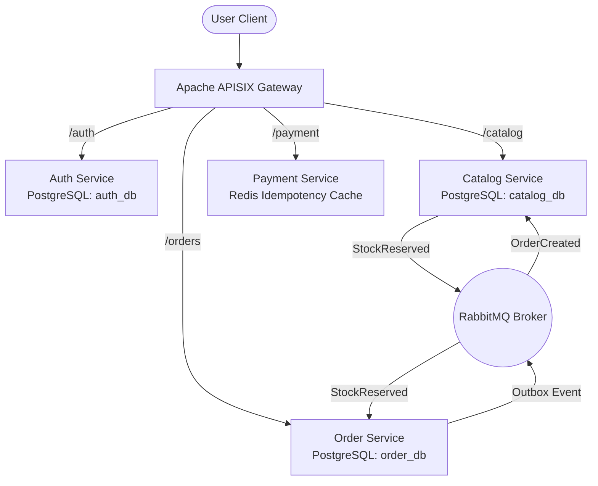

# OverclockKart 2.0

A production-ready, distributed e-commerce platform built from scratch to demonstrate advanced microservice design patterns, asynchronous I/O, and event-driven data consistency.

## 🏗 Architecture Highlights

- **FastAPI**: All core services built using asynchronous Python.
- **Transactional Outbox Pattern**: Mitigates dual-write vulnerabilities between PostgreSQL and RabbitMQ.
- **Saga Orchestration**: Centralized distributed transaction management across isolated database boundaries.
- **Strict Idempotency**: Redis-backed locking on Stripe webhooks to prevent duplicate processing.
- **API Gateway**: Apache APISIX operating at the cluster edge with a `forward-auth` plugin.
- **Observability**: Fully instrumented with OpenTelemetry, Prometheus, and Grafana.

## 📊 System Diagram



## 🚀 Quickstart

1. **Spin up the Kubernetes cluster:**
   ```bash
   make cluster-up
   ```

2. **Deploy the Infrastructure and Microservices:**
   ```bash
   make deploy
   ```

3. **Run the Interactive Demo / E2E Tests:**
   This will run through the entire Saga checkout flow and payment webhook idempotency testing.
   ```bash
   chmod +x scripts/live_demo.sh
   ./scripts/live_demo.sh
   ```

4. **Teardown:**
   ```bash
   make cluster-down
   ```
